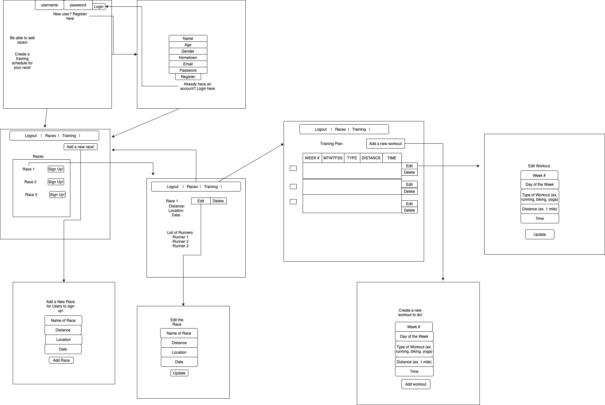

# run-with-me-react
SEI Capstone

### User Stories 

1. User should be able to create an account (register) and then automatically be logged in
2. User should be able to log in if they have already registered for an account 
3. If email already exists in database, user should not be able to register with that same email address
4. Registered/logged in user should be redirected to race page where there are all the created races from users are displayed. User should be able to join (sign up for) races that were created.
5. User is able to logout of session
6. If you click on a specific race, it should show you the race details and all the users that have signed up for that race
7. User is able to create a race and is added to the list of runners who have signed up
8. User (who is the admin and created the race) will be able to update or delete the race info
9. User is also able to come up with their own training plan where they can see all of their workouts
10. User can create, edit and delete their workouts
11. User can check off workouts that they have completed 

